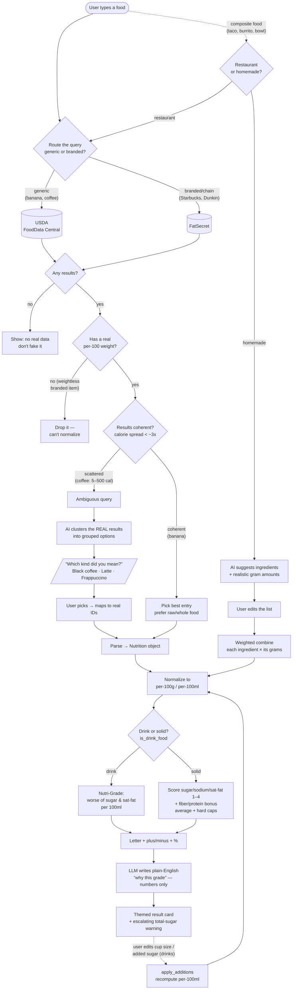
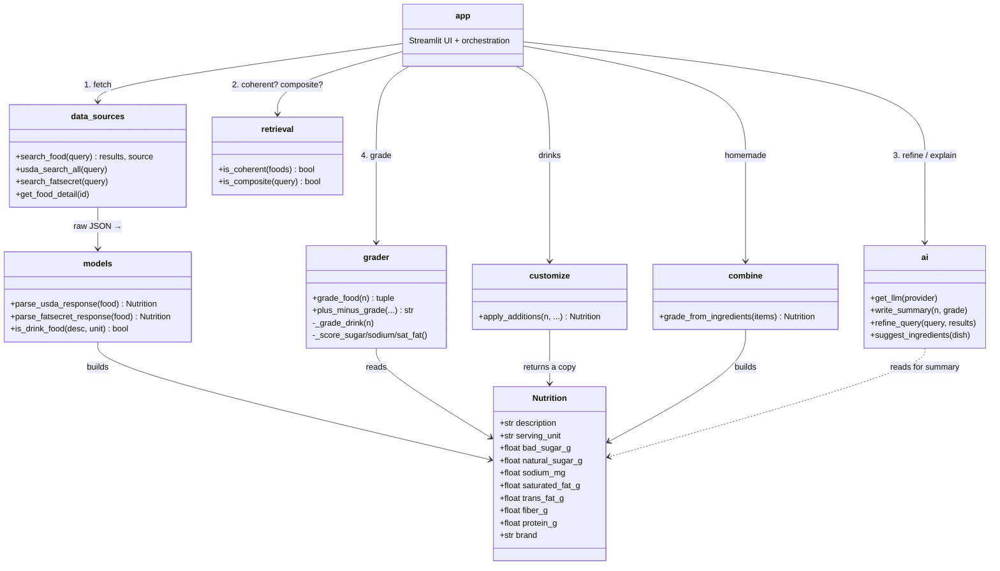

## Architecture diagrams

Now that the two data sources are clear, here's how a search actually moves
through the system. The first diagram is the **detailed flow** (every decision
point, including ambiguous queries); the second is a **UML class view** of the
core types and one-way module dependencies. Both render automatically on GitHub.

### Flow — a query's full journey

**How to read it:** the spine runs top-to-bottom — **route → fetch → validate
(weight check) → resolve ambiguity → parse → normalize → grade → explain →
render.** Two side-loops hang off the spine: the **customization loop** (drinks
re-grade when you enter your real cup size / additions) and the **composite
branch** (a homemade dish is built from weighted ingredients, then rejoins the
normal path at normalization). Notice every "fork" is a real decision in the
code: *any results?*, *has a weight?*, *coherent or ambiguous?*, *drink or
solid?* — each maps to a specific check.

### UML — core types and module dependencies

The UML captures the spine: **data sources feed `models`, which build a
`Nutrition`; `retrieval` decides routing/ambiguity; `grader` judges; `ai`
explains; `customize`/`combine` handle the two special cases; `app` orchestrates
everything.** Dependencies flow one way — `app` knows about all of them, but
`grader` and `models` know nothing about the UI, which is what keeps the core
logic testable in isolation.

---